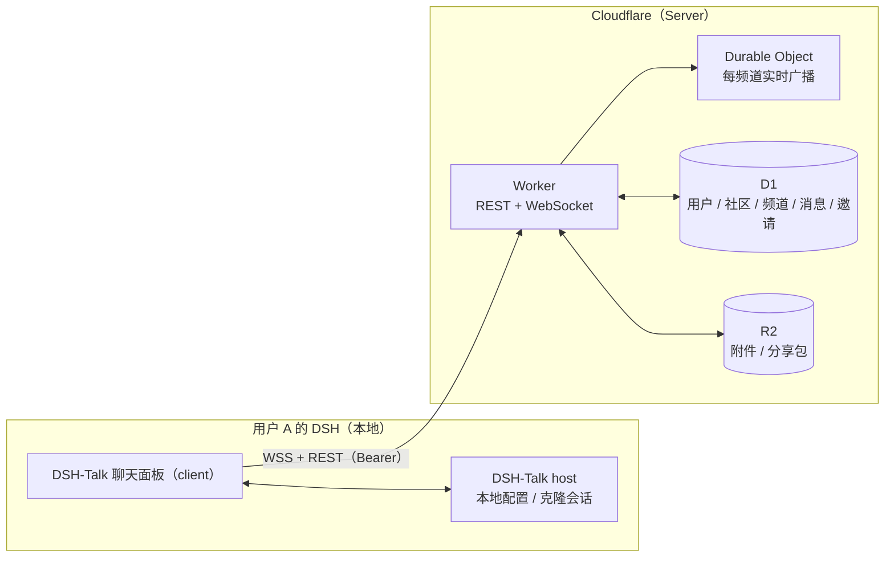

# DSH-Talk

> 把「社区」装进 DSH —— 在 DeepSeek Harness 里直接和同好聊天、提问求助、发通知，社区内容与你的 Agent 工作区不再割裂。

一个面向 DSH 用户的类 Discord 社区插件：注册一个社区账号后，就可以在 DSH 面板里自建或加入社区，实时聊天、贴图传文件、`@` 提醒、管理成员，全程不需要跳出 DSH。

---

## 功能清单

### 账号与身份
- [x] 邮箱注册：注册后发送 **6 位验证码**，验证通过才能登录
- [x] 邮箱 + 密码登录，会话安全保存（Bearer）
- [x] 忘记密码：通过邮箱验证码在面板内**直接重置密码**（无需打开邮件链接）
- [x] 修改用户名、上传 / 更换头像
- [x] 退出登录

### 社区
- [x] 一键创建社区（公开 / 私有），自动生成**固定不变**的邀请码与默认频道
- [x] 公开社区直接加入；私有社区凭邀请码加入
- [x] **发现公开社区**：侧栏「＋」弹窗切到「发现」，浏览公开社区目录、按名称 / 简介搜索，已加入的一键进入
- [x] 我的社区列表：未读频道数 + `@` 提及未读数一目了然
- [x] 编辑社区名称 / 简介 / 可见性 / 头像
- [x] 成员管理：成员列表与搜索、按角色分配 / 收回、移除成员、**转让所有权**
- [x] **封禁 / 解封**：把成员拉黑以阻止其重新加入，随时可在成员面板解封
- [x] 所有者可**删除社区**（频道、消息、成员级联清除）
- [x] 加入 / 自建社区数上限（各 10 个）；自建另受**每 24 小时 3 个**的滚动频率限制，防止滥用

### 频道
- [x] 三种互斥频道定位，侧边栏按类型区分图标：
  - 文字 —— 全员自由发言
  - 公告 —— 默认对 `@everyone` **只读**，仅所有者 / 管理员或经频道权限放行「发送消息」的角色可发
  - 话题 —— 频道主面板即话题列表，点进某条话题才聊天（24h 无人回复自动归档）
- [x] 频道的创建、改名、改主题、改类型、删除、排序（上移 / 下移）

### 角色与权限
- [x] Discord 式角色模型：每个社区自带 `@everyone`（隐式作用于全体成员）与一个预设「管理员」角色（仅 `ADMINISTRATOR` 位，可改名可删除，需手动分配）
- [x] 自定义角色：新建 / 改名 / 配色 / 删除、上移 / 下移调整层级；成员可同时持有多个角色，基础权限按并集计算
- [x] 细粒度权限位：查看频道、发送消息、发起 / 管理讨论组、管理消息 / 频道 / 社区 / 角色、邀请成员、踢人、封禁、管理员
- [x] **频道权限覆盖**：针对 `@everyone` / 角色 / 成员单独设置 allow / deny（仅频道级权限位）
- [x] 层级防提权：只能操作层级**严格低于**自己的角色与成员，也不能授予自己没有的权限位
- [x] 权限变更实时下发：在线连接被重新校验，失去频道可见性的连接会被主动断开

### 讨论组（话题）
- [x] 文字 / 话题频道下可开讨论组：独立成串、24 小时无人发言自动归档（发言即恢复）
- [x] **可见性**：公开（社区成员自由进出）/ 私密（非成员可见但加锁）
- [x] 私密组可设**进入密码**：有密码可凭密码进入；未设密码则只能由组内成员拉入
- [x] 组内成员可从社区成员中拉人、移出成员；成员可自行退出

### 消息
- [x] 文本消息，`@成员` 提及并高亮提醒
- [x] 附件：图片（内联预览）与任意文件（下载），一条消息最多 4 个
- [x] 编辑 / 删除消息（作者本人，或拥有「管理消息」权限的人）
- [x] **表情回应**：给消息加 emoji（同人同 emoji 再点即取消），按 emoji 聚合并实时同步
- [x] **消息搜索**：按关键词模糊匹配社区内消息正文；可用频道 / 作者 / 时间范围（24h / 7d / 30d）/ 仅 `@我` 收窄范围，倒序返回
- [x] 实时收发：新消息、编辑、删除、表情回应即时同步到所有在线成员

### 实时与未读
- [x] 每个频道一条 WebSocket 长连接，心跳保活、断线自动重连
- [x] 频道头部显示当前**在线人数**，点开可看在线成员与状态（在线 / 离开随窗口焦点自动切换）
- [x] **社区在线聚合**：跨频道与活跃讨论组按用户去重，侧栏与成员面板展示社区在线成员
- [x] 已读状态上报；社区栏未读气泡与 `@` 提及提醒（频道与讨论组各一套）

### 邀请与站内信
- [x] 邀请已注册用户加入（用户名或邮箱）→ 对方收到**站内信 + 邮件**
- [x] 收件箱：接受 / 拒绝邀请、已处理状态、一键全部已读、铃铛未读角标

### 分享
- [x] **分享 DSH 会话**：把本机一个 DSH 会话打包分享到社区；他人点开卡片弹窗即可「克隆到本地的会话」
- [x] **分享卡片**：发消息时可附带一张自己创建的分享，卡片内嵌在消息里；点击卡片弹出详情（分享者 / 大小 / 时间 / 事件数），可下载包体

---

## 使用它需要什么

- **DSH 本体**：`npx @deepseek-ai/dsh`
- **一个 DSH-Talk Server**：官方会提供一个公共地址；也可以参考下面的「部署到 Cloudflare（生产）」自己托管一个。
- 首次使用在插件设置里填好 `serverUrl` 后，面板内用邮箱注册账号即可。

> 发信依赖 Resend 等事务邮件（验证码 / 重置密码 / 邀请邮件）。若 Server 未配置发信，请改看服务端日志里打印的验证码。

---

## 快速开始（本地跑通全栈）

### 0. 环境

- Node.js ≥ 20、pnpm ≥ 9、[Wrangler](https://developers.cloudflare.com/workers/wrangler/)
- DSH：`npx @deepseek-ai/dsh`

### 1. 启动 Server

```bash
# 仓库根目录
pnpm install
pnpm dev:server      # Hono Worker，默认 http://127.0.0.1:8787
```

认证密钥写入仓库根 `.env`（predev 自动同步到 `packages/server/.dev.vars`，**不要提交**）：

```bash
BETTER_AUTH_SECRET=一个不少于32字符的随机串   # 必填
RESEND_API_KEY=re_xxx                        # 可选：配了才真正发邮件
# BETTER_AUTH_URL=http://127.0.0.1:8787      # 可选：对外地址
```

首次启动前生成并应用数据库迁移：

```bash
cd packages/server
pnpm db:generate     # 由 schema 生成迁移 SQL
pnpm db:apply-local  # 写入本地 D1
```

### 2. 构建并载入插件

```bash
pnpm build    # host/client 产物写入 lib/
pnpm dev      # overlay 模式：自动打包并启动 DSH Web（默认 http://127.0.0.1:3080）
```

侧栏底部出现 **DSH-Talk（社区）** 入口即加载成功；改源码后 `pnpm dev` 会自动重打包，刷新页面即可。

### 3. 开始使用

1. 打开 DSH-Talk 面板 → **注册**一个邮箱账号，查收 6 位验证码完成邮箱验证；
2. **创建**第一个社区（公开），或在 **「＋ 加入」** 里输入别人的邀请码加入私有社区；
3. 在社区里 **新建频道**（文字 / 公告 / 话题），进入频道聊天、传图、`@` 人；
4. 拉上第二个用户连同一个 Server 验证实时互通；忘记密码可以随时用「忘记密码？」通过验证码找回。

> 单机联调两台「用户」时，请使用两个独立的 DSH profile（不同端口、不同配置目录），连接同一个 Server。

---

## 部署到 Cloudflare（生产）

Server 完全自包含，按下面步骤可以部署到自己的 Cloudflare 账号。

### 1. 准备资源

```bash
# 登录 Cloudflare
npx wrangler login

# D1 元数据库（记下输出的 database_id）
npx wrangler d1 create dsh-talk

# R2 桶（附件与分享包）
npx wrangler r2 bucket create dsh-talk-assets
```

把 `npx wrangler d1 create` 返回的 `database_id` 填回 [wrangler.jsonc](file:///e:/dsh-talk/packages/server/wrangler.jsonc) 的 `d1_databases[0].database_id`，并按需修改 `name`、`routes`（自定义域）与 `r2_buckets.bucket_name`。

### 2. 配置认证变量

`BETTER_AUTH_URL` 是非敏感值，直接写在 `wrangler.jsonc` 的 `vars` 里（改成你的线上地址，**必须与自定义域一致**，否则请求会因 Host 不在允许名单而被拒）。密钥用 secret 注入：

```bash
cd packages/server
npx wrangler secret put BETTER_AUTH_SECRET   # ≥ 32 字符随机串
npx wrangler secret put RESEND_API_KEY       # 可选；不配则验证码只打印到服务端日志
```

### 3. 应用数据库迁移

```bash
# 仓库根目录；等价于 wrangler d1 migrations apply dsh-talk --remote
pnpm --filter @dsh-talk/server db:apply-remote
```

认证相关表（user / session / account / verification）无需迁移：首次访问 `/api/auth/*` 时由 Better Auth 自举创建（幂等）。

### 4. 部署

```bash
pnpm deploy:server   # 等价于 packages/server 下的 wrangler deploy
```

### 5. 客户端接入

在 DSH 插件设置里把 `serverUrl` 改成你的线上地址（`https://<你的自定义域>`），即可注册 / 登录使用。自定义域有变动时，记得同步更新 `wrangler.jsonc` 的 `vars.BETTER_AUTH_URL` 与插件设置里的 `serverUrl`。

---

## 架构一览



- **client（浏览器）**：聊天界面、WebSocket 实时连接、附件直传、站内信。
- **host（Node.js）**：保存 serverUrl / token 等本地设置；读本机 DSH 会话并打包成分享包，也能把分享包还原成本地会话。
- **server（Cloudflare）**：唯一的数据中心——REST + WebSocket API、每频道一个 Durable Object 做实时扇出、D1 存业务数据、R2 存附件与分享包；完全自包含，可自托管。

---

## 常见配置

### 插件设置（DSH 设置页）

| 键 | 默认 | 说明 |
| --- | --- | --- |
| `serverUrl` | `http://127.0.0.1:8787` | Server 地址；生产填 `https://<你的域名>` |
| `handle` | `""` | 当前账号用户名（登录后自动写入） |
| `token` | `""`（secret） | 会话令牌，登录后自动写入 |
| `autoReconnect` | `true` | WebSocket 断线自动重连 |
| `share.maxSizeMb` | `50` | 会话分享包体积上限 |

### Server 环境变量

| 变量 | 必填 | 说明 |
| --- | --- | --- |
| `BETTER_AUTH_SECRET` | 是 | 会话签名密钥，≥ 32 字符 |
| `BETTER_AUTH_URL` | 否 | 认证对外地址（邮箱链接基于它）；缺省按请求 Host 推导 |
| `RESEND_API_KEY` | 否 | 事务邮件发送密钥；未配置时验证码只打印到服务端日志 |

其余业务限额（单条消息 4000 字、上传 R2 的单个对象 50 MiB（附件与分享包统一）、每条 4 个附件、讨论组 24h 自动归档等）在 `packages/server/src/constants.ts` 中集中维护；每人加入 / 自建社区各 10 个、自建每 24 小时最多 3 个的限额在社区路由内校验。

---

## 仓库结构（给开发者）

```
dsh-talk/
├── packages/
│   ├── host/      # DSH 插件 host：注册 talk 设置 + 本地接口
│   ├── client/    # DSH 插件 client：React 聊天界面 + 连接层
│   ├── types/     # ⭐ 全栈共享类型：实体 / REST / WebSocket / RPC 契约
│   └── server/    # ⭐ Cloudflare Server：Hono Worker + D1 + R2 + Durable Object
├── lib/           # 打包产物（host + client）
├── tsdown.config.ts / cordis.yml / cordis.patch.yml
├── biome.json     # 格式 / lint / import 排序
└── package.json
```

常用命令（在仓库根目录执行）：

```bash
pnpm build                # host/client 打包到 lib/
pnpm dev                  # watch + overlay 启动 DSH Web
pnpm dev:server           # 本地启动 Server
pnpm typecheck            # 全 workspace 类型检查
pnpm lint / pnpm check    # Biome 质量检查
pnpm --filter @dsh-talk/server db:generate   # 改 schema 后生成迁移
pnpm --filter @dsh-talk/server db:apply-local
pnpm --filter @dsh-talk/server test:smoke    # WebSocket 冒烟测试（需本地 Server 已启动）
```

约定：改共享接口先改 `packages/types`；变更数据库先 `db:generate` 并审查 SQL；提交信息用 `feat(server): …` / `fix(client): …` 风格。

---

## License

MIT
