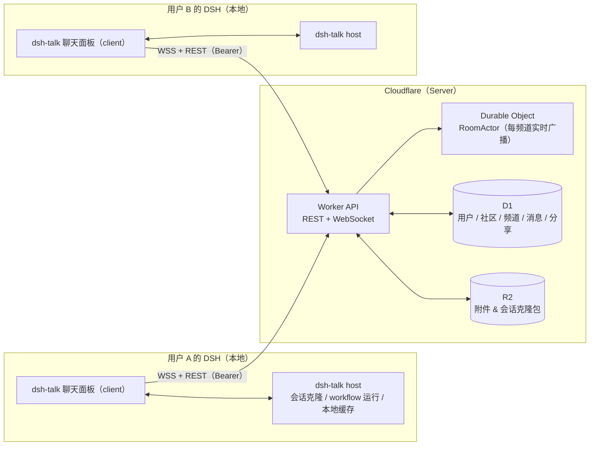

# dsh-talk

> 把「社区」装进 DSH —— 面向 DSH 用户与开发者的类 Discord 社区插件：频道实时聊天、提问求助、分享工作流（workflow）与一键克隆会话，全程无需跳出 DSH。

*A Discord-like community living inside DSH (DeepSeek Harness): real-time channels, Q&A with a resolution loop, and sharing workflows or full agent sessions that others can clone — one click, identical trajectory, on their own machine.*

---

## 它解决什么问题

DSH 用户与开发者今天要「跳出 DSH」才能获得社区支持：

| 痛点 | dsh-talk 的答案 |
| --- | --- |
| 遇到问题要在 Discord / 微信群 / 论坛之间来回切，上下文丢失 | 在 DSH 内直接进入频道提问、贴代码、被解答，`#help` 有解决闭环 |
| 「帮我看看我这个会话为什么这样」只能截图、口述 | 分享一个链接/卡片，对方一键克隆：本地生成记录与整个轨迹完全一致的会话副本，可直接打开查看甚至继续 |
| 好用的 workflow 无法分发、无法复用 | 以纯 JSON 载荷 `{meta, script, args}` 分享 workflow，对方本地一键运行 |
| 社区内容与自己的 Agent 工作区割裂 | 分享/克隆/运行全部发生在本地 DSH 与社区 Server 之间，产出留在自己的工作区 |
| 默认只有单一官方群，圈子无法生长 | 任何注册用户都能自建社区（类 Discord「服务器」）：公开可被「发现」加入，或发社区邀请码私有加入 |

> 目标场景：多社区（自行创建 / 「发现」加入 / 私有邀请码加入），社区内 `#general` 闲聊、`#help` 求助解答、`#showcase` 分享工作流与「会话克隆」卡片、`#announcements` 社区公告。

---

## 架构总览



### 双插件分工（DSH 客户端插件标准形态）

DSH 插件天然分为两个运行环境，本项目通过 `package.json` 的 `exports` 与 `dsh.client` 声明同时提供两份产物：

- **client（浏览器）**：聊天 UI、与 Server 的 WebSocket 长连接、未读状态、分享卡片、R2 预签名直传。
- **host（Node.js）**：插件配置（`ctx.settings` 命名空间 `talk`）、克隆恢复器（把分享包写回本地 DSH 会话持久化与索引）、workflow 运行器、本地缓存（`ctx.storageDomain` 自定义 domain `talk`）。

client 需要 host 能力时走 host 在 `webServer` 上注册的同源接口（当前：`/api/talk/config` 读写 token/serverUrl 等配置，语义见 `@dsh-talk/types/rpc` 的 `SettingsRpc`）；克隆/运行 workflow 等重活后续按需扩展。

### Server（Cloudflare 全家桶，无任何第三方云依赖）

一个 Server 承载多个社区（层级 **Server → 社区 → 频道**，社区即 Discord 的「服务器」，可由注册用户自行创建）：

- **Worker**：提供 REST + WebSocket 入口
- **Durable Object（RoomActor）**：每个频道一个实例，负责连接管理与实时广播
- **D1**：用户 / 社区 / 频道 / 消息 / 分享等元数据（源真）
- **R2**：图片附件与会话 / 工作流分享包

Server 代码在本仓库 `packages/server/` 目录下（独立工程，支持自托管）。

---

## 仓库结构

```
dsh-talk/
├── packages/
│   ├── host/             # DSH 插件 host（Node.js：注册 talk 配置 + /api/talk/config）
│   │   ├── src/index.ts  # 入口：ctx.settings 命名空间 'talk' + webServer 路由
│   │   ├── package.json  # 包名 @dsh-talk/host
│   │   └── tsconfig.json
│   ├── client/           # DSH 插件 client（浏览器 React UI + 连接层，源码打进 lib/client.js）
│   │   ├── src/
│   │   │   ├── index.ts      # client 入口：sidebar「社区」入口 + shell.overlay 面板
│   │   │   ├── augment.ts    # 类型化 slot 接入（拉入官方 SlotMap 合并）
│   │   │   ├── components.tsx# 面板 UI（身份注册 / 我的社区列表）
│   │   │   ├── store.ts      # UI store：host 配置 → Server 身份 → 我的社区
│   │   │   ├── server.ts     # Server REST client（复用 @dsh-talk/types/api 契约）
│   │   │   ├── ws.ts         # Server WebSocket client（复用 @dsh-talk/types/ws 契约）
│   │   │   └── config.ts     # 同源读 /api/talk/config（取 token/serverUrl）
│   │   ├── package.json      # 包名 @dsh-talk/client
│   │   └── tsconfig.json
│   ├── types/            # ⭐ 全栈共享类型包（接口定义都在这里）
│   │   ├── src/
│   │   │   ├── entities.ts      User/Community/Channel/Message/Share 等 D1 实体
│   │   │   ├── api/*            Server REST API 请求/响应类型 + 路由契约注释
│   │   │   ├── ws.ts            Server WebSocket 帧协议（client↔server）
│   │   │   ├── rpc.ts           DSH 插件 client↔host RPC 接口
│   │   │   └── index.ts         barrel 导出
│   │   ├── package.json         包名 @dsh-talk/types
│   │   └── tsconfig.json
│   └── server/           # ⭐ Cloudflare Server（Hono Worker + D1 + R2 + Durable Object）
│       ├── wrangler.toml     # D1 / R2 / DO bindings + vars
│       ├── drizzle.config.ts # drizzle-kit 配置（sqlite 方言 + 迁移目录）
│       ├── src/
│       │   ├── worker.ts     # Hono 入口：全局中间件 + 路由装配 + /ws upgrade
│       │   ├── room.ts       # RoomActor（Durable Object，每频道实时广播）
│       │   ├── types.ts      # Env / Hono Variables 类型
│       │   ├── db/
│       │   │   ├── schema.ts # ⭐ Drizzle ORM schema（8 张表 + 索引 + 行类型）
│       │   │   └── index.ts  # createDbForWorker(D1) / createDbForLocal(sqlite 路径)
│       │   ├── lib/          # errors / response / auth / db 注入 / middleware 通用
│       │   └── routes/       # auth / communities / messages / shares / r2 分组
│       ├── package.json      # 包名 @dsh-talk/server，依赖 hono + @dsh-talk/types
│       └── tsconfig.json
├── lib/                  # 打包产物：host lib/index.{mjs,cjs} + 浏览器 lib/client.js
├── tsdown.config.ts      # 双入口打包：host（packages/host）+ client（packages/client）
├── cordis.yml            # 本地开发：insert packages/host 源码进 dsh 配置树
├── cordis.patch.yml      # 发布：作为 bundle patch 被 dsh 加载
├── pnpm-workspace.yaml   # packages/* workspace + 供应链检查策略（见下方「供应链检查」）
├── biome.json            # Biome 配置：格式 + lint + import 排序
├── tsconfig.json
└── package.json          # 双面插件壳：host/client 源码来自 packages，由 tsdown 打产物
```

---

## 快速开始（本地开发）

### 0. 前置

- Node.js ≥ 20、pnpm ≥ 9
- [Wrangler](https://developers.cloudflare.com/workers/wrangler/)（跑 Server 无需 Cloudflare 账号）
- DSH 本体：`npx @deepseek-ai/dsh`

> 注意：本仓库声明的 `@deepseek-ai/dsh-tools` 等 peer 依赖版本为 `0.1.3-alpha.2`，如本地实测 DSH 版本不同，请先 `pnpm run update` 对齐（见下方开发指南）。

### 1. 本地启动 Server

```bash
# 仓库根目录
pnpm install        # 安装 host + types + server 三个 workspace 包
pnpm dev:server     # = pnpm --filter @dsh-talk/server dev，默认 http://127.0.0.1:8787
```

首次启动时用环境变量注入平台注册码（AUTH_INVITE_CODES 不要写进 wrangler.toml，走 env）：

```bash
# PowerShell
$env:AUTH_INVITE_CODES = "dshtalk-dev-0001"
pnpm dev:server
```

首次跑 Server 前用 Drizzle 生成迁移并写入本地 D1：

```bash
cd packages/server
pnpm db:generate       # 对比 src/db/schema.ts → 生成 SQL 到 drizzle/
# 方式 A（本地 Drizzle studio/快速开发）：连到本地 SQLite
#   pnpm db:up
# 方式 B（对齐 Cloudflare D1）：用 wrangler 把迁移写入本地 D1
pnpm db:apply-local
```

> 迁移生成后，也可手工执行 SQL 文件：`wrangler d1 execute dsh-talk-server --local --file=./drizzle/0000_xxxx.sql`

### 2. 启动 DSH 并加载插件

```bash
# 仓库根目录
pnpm install
pnpm dev            # = npx @deepseek-ai/dsh web --patch ./cordis.yml
```

打开 DSH Web GUI（默认 http://127.0.0.1:3080），侧栏出现 **dsh-talk** 入口。

### 3. 首次连接

1. 打开 dsh-talk 面板 → 「注册身份」：输入**平台注册码**与昵称（如 `alice`）→ Server 返回令牌并自动写入本地设置；
2. 创建第一个社区（自动获得默认频道），或从「发现」加入公开社区 / 输入社区邀请码加入私有社区；
3. 进入社区内的 `#general`，用第二个用户验证实时互通：同机联调请再起一个独立的 DSH profile（不同端口、不同配置树，另用一个平台注册码）连接同一个 Server；
4. 两个用户都能在 `#showcase` 发布分享卡片、在 `#help` 提问并标记已解决。

---

## 配置

### 插件设置（DSH 内设置页 + `ctx.settings` 命名空间 `talk`）

| 键 | 类型 | 默认 | 说明 |
| --- | --- | --- | --- |
| `serverUrl` | string | `http://127.0.0.1:8787` | Server 地址；生产环境填 `https://<你的域名>` |
| `handle` | string | `""` | 社区昵称（平台注册码换取令牌时写入） |
| `token` | string（secret） | `""` | 社区访问令牌，`settings` 用户层覆盖 |
| `autoReconnect` | boolean | `true` | WebSocket 断线自动重连 |
| `share.maxSizeMb` | number | `50` | 本地上传体积上限（需 ≤ 服务端上限） |

### Server 环境变量（`packages/server/`）

| 变量 | 说明 | 默认 |
| --- | --- | --- |
| `AUTH_INVITE_CODES` | 逗号分隔的**平台注册码**（仅用于开通账号，单次使用） | 必填（dev 可种子） |
| `COMMUNITY_CREATE_DAILY_LIMIT` | 每用户每日可创建社区数 | `3` |
| `MAX_COMMUNITIES_PER_USER` | 每用户累计可创建社区数上限 | `10` |
| `ADMIN_HANDLES` | 逗号分隔的平台管理员昵称 | `""` |
| `MAX_MESSAGE_LENGTH` | 单条消息字符上限 | `4000` |
| `MAX_SHARE_BYTES` | 单分享包体积上限 | `52428800`（50 MiB） |

---

## 开发指南

### 脚本

```bash
pnpm build        # 双入口打包：host → lib/index.{mjs,cjs}，client → lib/client.js
pnpm dev          # 本地起 dsh web 并 insert 本插件
pnpm run update   # 对齐 @deepseek-ai/* peer 依赖版本

# 类型检查
pnpm typecheck        # types + server + host + client 全量
pnpm typecheck:server # 只查 server
pnpm typecheck:plugin # 只查 host（packages/host/）
pnpm typecheck:client # 只查 client（packages/client/）

# 代码质量（Biome）
pnpm lint         # lint 只报告
pnpm lint:fix     # lint 自动修复
pnpm format       # biome format --write .
pnpm check        # 一键 format + lint + import 排序，并写回
pnpm check:ci     # 严格模式（CI）：任何差异 / 告警都失败
```

### 供应链检查（为什么「完全禁用」）

pnpm v11+ 默认开启供应商检查：新依赖要满足「发布年龄 ≥ 1440 分钟」、每次 install 还会对 lockfile 全表复验（报错形如 `Lockfile failed supply-chain policy check`）。dsh-talk 依赖大量 `@deepseek-ai/*` 的 alpha 预发布包（发布即需安装），因此通过 [pnpm-workspace.yaml](file:///e:/dsh-talk/pnpm-workspace.yaml) 显式关闭：

```yaml
minimumReleaseAge: 0      # 发布年龄要求 = 0：任意版本发布后立即允许安装
trustLockfile: true       # 信任 lockfile，跳过整表供应链复验
```

> 注意：该配置放在 `pnpm-workspace.yaml`（pnpm v11+ 生效）；`minimum-release-age-exclude` 白名单式做法仅对 pnpm ≤ v10 的 `.npmrc` 生效，本项目已不再使用。

### 双包约定（实现时必须满足）

1. `package.json`：`exports` 增加 `"./client"`（浏览器入口），并声明 `"dsh": { "client": { "inject": [...], "platform": "web" } }`；
2. 浏览器 UI 挂载走 slot 机制（`ctx.slots.register` / `ctx.slots.inject`），入口孔位以 `sidebar.footer.action`（列表槽）等 DSH 内置孔位为参考锚点；
3. 插件语言包用 `ctx.locale.register('talk', 'zh'|'en', …)` 注册，UI 文案先做 `zh`，`en` 同步补齐；
4. host 能力（克隆恢复、workflow 运行）一律要求用户确认，禁止静默执行。

### 共享类型包 `@dsh-talk/types`

所有接口定义集中在 [packages/types/](file:///e:/dsh-talk/packages/types)：

| 文件 | 内容 |
| --- | --- |
| `src/entities.ts` | D1 表对应的实体类型（User / Community / Channel / Message / Share…） |
| `src/api/*` | Server REST API 请求/响应类型 + 路由契约总表注释 |
| `src/ws.ts` | Server WebSocket 协议帧：请求/应答/推送（含联合类型 `ClientFrame` / `ServerFrame`） |
| `src/rpc.ts` | DSH 插件 client ↔ host 的 RPC 方法签名总接口 `TalkHostRpc` |

根 `package.json` 已通过 `"@dsh-talk/types": "workspace:*"` 直接依赖，写 host / server / client 时直接 `import type { … } from "@dsh-talk/types"` 或子路径即可。

### 本地联调注意

- `cordis.yml` 用于本地开发（直接 `insert` 指向 `./packages/host/src/index.ts` 源码）；
- `cordis.patch.yml` 用于发布形态（`insert` 指向包名 `dsh-talk`，由 DSH 的 bundle patch 机制加载）；
- 双用户联调需使用两个独立的 DSH profile（不同端口、不同配置目录），避免数据冲突。

---

## License

MIT
