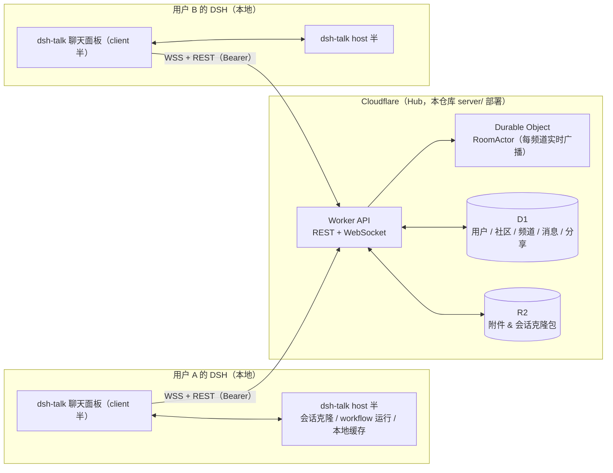

# dsh-talk

> 把「社区」装进 DSH —— 面向 DSH 用户与开发者的类 Discord 社区插件：频道实时聊天、提问求助、分享工作流（workflow）与**一键克隆会话**，全程无需跳出 DSH。

*A Discord-like community living inside DSH (DeepSeek Harness): real-time channels, Q&A with a resolution loop, and sharing workflows or full agent sessions that others can clone — one click, identical trajectory, on their own machine.*

> **当前状态**：MVP 规划阶段 —— README 与 [docs/PRD.md](docs/PRD.md) 已就绪（评审中）。代码仍为仓库脚手架（`src/index.ts` hello 示例），`server/`、`src-client/` 等目录为规划布局，待 M0 预研后按 Roadmap 实现。

---

## 目录

- [它解决什么问题](#它解决什么问题)
- [MVP 功能](#mvp-功能)
- [架构总览](#架构总览)
- [仓库结构](#仓库结构)
- [快速开始（本地开发）](#快速开始本地开发)
- [配置](#配置)
- [开发指南](#开发指南)
- [Roadmap](#roadmap)
- [相关文档](#相关文档)
- [License](#license)

---

## 它解决什么问题

DSH 用户与开发者今天要「跳出 DSH」才能获得社区支持：

| 痛点 | dsh-talk 的答案 |
| --- | --- |
| 遇到问题要在 Discord / 微信群 / 论坛之间来回切，上下文丢失 | 在 DSH 内直接进入频道提问、贴代码、被解答，`#help` 有解决闭环 |
| 「帮我看看我这个会话为什么这样」只能截图、口述 | 分享一个链接/卡片，对方**一键克隆**：本地生成记录与整个轨迹完全一致的会话副本，可直接打开查看甚至继续 |
| 好用的 workflow 无法分发、无法复用 | 以纯 JSON 载荷 `{meta, script, args}` 分享 workflow，对方本地一键运行 |
| 社区内容与自己的 Agent 工作区割裂 | 分享/克隆/运行全部发生在本地 DSH 与社区 Hub 之间，产出留在自己的工作区 |
| 默认只有单一官方群，圈子无法生长 | 任何注册用户都能自建社区（类 Discord「服务器」）：公开可被「发现」加入，或发社区邀请码私有加入 |

> 目标场景（Discord-like）：多社区（自行创建 / 「发现」加入 / 私有邀请码加入），社区内 `#general` 闲聊、`#help` 求助解答、`#showcase` 分享工作流与「会话克隆」卡片、`#announcements` 社区公告。

---

## MVP 功能

第一版（MVP）聚焦「聊天 + 分享/克隆」，详见 [docs/PRD.md](docs/PRD.md)。

| 模块 | 能力 | 状态 |
| --- | --- | --- |
| 频道聊天 | 实时收发（WebSocket）、断线重连、历史分页、Markdown + 代码块、图片上传预览、`@提及` 高亮与未读红点 | MVP |
| 社区自建 | 任何注册用户可创建自己的社区（Discord「服务器」语义）：公开可被「发现」、私有需社区邀请码；owner 管理频道与邀请码 | MVP |
| 加入与导航 | 平台注册码开通账号 → 社区抽屉：我的社区 / 发现（公开目录）/ 创建社区 | MVP |
| 问答闭环 | `#help` 提问消息、作者可标记「已解决」 | MVP |
| 会话分享 | 将当前会话打包上传（可含子会话与附件；出于隐私默认**不含**附件），发布为分享卡片 | MVP |
| **一键克隆会话** | 点击他人卡片 → 本地重建一份记录/轨迹完全一致的会话副本 | MVP（含 M0 技术门禁，见 PRD §14） |
| 工作流分享 | 分享 workflow 载荷 `{meta, script, args}` 并在本地运行 | MVP（运行通道含 M0 门禁） |
| 通知 | 未读角标、`@我` 高亮 | MVP |
| 配置 | Hub 地址、昵称/令牌、分享体积上限（插件设置页） | MVP |
| 消息反应 / 引用回复 / 线程视图 | 表情回应、回复引用、线程折叠 | P1 |
| 消息编辑/删除、全文搜索、举报/封禁 | 社区治理与检索增强 | P1 |
| 私信 DM、频道级权限/复杂角色体系、跨社区运营后台 | Discord 完整形态 | P2 |
| Agent 参与 | 本地 Agent 可读频道、经审批后发帖/答疑 | P1（设计预留） |

---

## 架构总览



**双半插件分工**（DSH 客户端插件标准形态，`package.json` 声明 `dsh.client` 并提供 `./client` 导出）：

- **client 半（浏览器）**：聊天 UI、与 Hub 的长连接、未读状态、分享卡片、上传（R2 预签名直传）。
- **host 半（Node）**：插件配置（`ctx.settings` 命名空间 `talk`）、**克隆恢复器**（把分享包写回本地 DSH 会话持久化与索引）、**workflow 运行器**、本地缓存（`ctx.storageDomain` 自定义 domain `talk`）。
- client 半需要 host 半能力的调用走 DSH 既有 RPC 通道（参照 `dsh-client-connection` 的 remote 机制）。

**Hub（Cloudflare 全家桶，无任何第三方云依赖）**：一个 Hub 承载多个社区（层级 **Hub → 社区 → 频道**，社区即 Discord 的「服务器」，可由注册用户自行创建）。Worker 提供 REST + WebSocket；每个频道一个 Durable Object（RoomActor）负责连接管理与实时广播；D1 存元数据（源真）；R2 存图片附件与会话/工作流分享包。详见 [docs/PRD.md §8](docs/PRD.md)。

---

## 仓库结构

```
dsh-talk/
├── src/                  # DSH 插件 host 半（TypeScript，tsdown 打包）
│   ├── index.ts          # 插件入口：配置、服务接线（当前为脚手架）
│   ├── config.ts         # schemastery Config（hubUrl / handle / token…）
│   ├── clone/            # 会话克隆恢复器（写回本地 DSH 会话）
│   ├── workflow/         # workflow 运行器
│   └── cache/            # storageDomain 'talk' 本地缓存/草稿
├── src-client/           # DSH 插件 client 半（浏览器 UI，React）
│   ├── index.ts          # slots 注册（入口/设置页）+ locale zh/en
│   ├── panels/           # 频道列表 / 消息区 / 输入区
│   ├── share/            # 分享对话框、卡片、克隆对话框
│   └── ws/               # Hub WebSocket 客户端
├── server/               # Cloudflare Hub（独立工程，可自托管）
│   ├── wrangler.toml     # D1 / R2 / DO bindings
│   ├── src/worker.ts     # 路由：REST + WS upgrade
│   ├── src/room.ts       # RoomActor（Durable Object）
│   ├── src/schema.sql    # D1 DDL
│   └── test/             # 本地集成测试（wrangler dev）
├── docs/
│   └── PRD.md            # 产品需求文档（MVP）
├── cordis.yml            # 本地开发：把本插件 insert 进 dsh 配置树
├── cordis.patch.yml      # 发布：作为 bundle patch 被 dsh 加载
├── tsdown.config.ts      # host 半打包
└── package.json
```

> 注：当前仓库只有 `src/index.ts`（脚手架，含 hello 示例的 `greeting`/`maxRetries` 配置）；`src-client/`、`server/` 及 `src/` 下的子目录为**规划布局**，随 M0–M3 逐步建立。实现时注意：client 半打包产物需按「双半包」约定导出（`exports["./client"]` + `dsh.client` 声明）。

---

## 快速开始（本地开发）

### 0. 前置

- Node.js ≥ 20、pnpm ≥ 9
- [Wrangler](https://developers.cloudflare.com/workers/wrangler/)（本地跑 Hub 无需 Cloudflare 账号）
- DSH 本体：`npx @deepseek-ai/dsh`（仓库依赖为 `@deepseek-ai/dsh-tools 0.1.3-alpha.2` 等，实测版本为 `0.1.2-rc.1`，首次开发前请 `pnpm run update` 对齐，见 [开发指南](#开发指南)）

### 1. 本地启动 Hub

```bash
cd server
pnpm install
pnpm dev            # wrangler dev，默认 http://127.0.0.1:8787
```

首次启动时用环境变量注入一个平台注册码（单次使用）：

```bash
# PowerShell
$env:AUTH_INVITE_CODES = "dshtalk-dev-0001"
pnpm dev
```

### 2. 启动 DSH 并加载插件

```bash
# 仓库根目录
pnpm install
pnpm dev            # = npx @deepseek-ai/dsh web --patch ./cordis.yml
```

打开 DSH Web GUI（默认 http://127.0.0.1:3080），侧栏出现 **dsh-talk** 入口。

> 本地联调 client 半（聊天 UI）的加载方式在 M0 确定：双半包的浏览器半按「包名」被 client modules 扫描，开发期需要把构建产物以包名形式（`pnpm link`/发布/本地 tarball）装进 profile，见 PRD §14 R1。

### 3. 首次连接

1. 打开 dsh-talk 面板 → 「注册身份」：输入**平台注册码**与昵称（如 `alice`）→ Hub 返回令牌并自动写入本地设置；
2. 创建第一个社区（自动获得默认频道），或从「发现」加入公开社区 / 输入社区邀请码加入私有社区；
3. 进入社区内的 `#general`，用第二个用户验证实时互通：同机联调请再起一个独立的 DSH profile（不同端口、不同配置树，另用一个平台注册码）连接同一个 Hub；
4. 两个用户都能在 `#showcase` 发布分享卡片、在 `#help` 提问并标记已解决。

---

## 配置

### 插件设置（DSH 内设置页 + `ctx.settings` 命名空间 `talk`）

| 键 | 类型 | 默认 | 说明 |
| --- | --- | --- | --- |
| `hubUrl` | string | `http://127.0.0.1:8787` | Hub 地址；生产环境填 `https://<你的域名>` |
| `handle` | string | `""` | 社区昵称（平台注册码换取令牌时写入） |
| `token` | string（secret） | `""` | 社区访问令牌，`settings` 用户层覆盖 |
| `autoReconnect` | boolean | `true` | WebSocket 断线自动重连 |
| `share.maxSizeMb` | number | `50` | 本地上传体积上限（需 ≤ 服务端上限） |

### Hub 环境变量（server/）

| 变量 | 说明 | 默认 |
| --- | --- | --- |
| `AUTH_INVITE_CODES` | 逗号分隔的**平台注册码**（仅用于开通账号，单次使用） | 必填（dev 可种子） |
| `COMMUNITY_CREATE_DAILY_LIMIT` | 每用户每日可创建社区数 | `3` |
| `MAX_COMMUNITIES_PER_USER` | 每用户累计可创建社区数上限 | `10` |
| `ADMIN_HANDLES` | 逗号分隔的平台管理员昵称（P1 治理用） | `""` |
| `MAX_MESSAGE_LENGTH` | 单条消息字符上限 | `4000` |
| `MAX_SHARE_BYTES` | 单分享包体积上限 | `52428800`（50 MiB） |

---

## 开发指南

### 脚本

```bash
pnpm build        # tsdown 打包 host 半（lib/）
pnpm dev          # 本地起 dsh web 并 insert 本插件
pnpm run update   # 对齐 @deepseek-ai/* peer 依赖版本
```

### 双半包约定（实现时必须满足）

1. `package.json`：`exports` 增加 `"./client"`（浏览器半入口），并声明 `"dsh": { "client": { "inject": [...], "platform": "web" } }`；
2. 浏览器半 UI 挂载走 slot 机制（`ctx.slots.register` / `ctx.slots.inject`），入口孔位以 `sidebar.footer.action`（列表槽）等 DSH 内置孔位为参考锚点 —— **精确的 SlotCore / dsh-client-web 契约需从源码仓库核对**（PRD §14 R1）；
3. 插件语言包用 `ctx.locale.register('talk', 'zh'|'en', …)` 注册，UI 文案先做 `zh`，`en` 同步补齐；
4. host 半能力（克隆恢复、workflow 运行）一律要求用户确认，禁止静默执行。

### 测试

- `server/`：`pnpm test`（wrangler dev + 集成测试：双用户消息互发、分享上传/下载）；
- 插件 host 半：单测覆盖 config 默认值、克隆包的 manifest 校验；
- 端到端：两个独立 DSH profile（`alice` / `bob`，各监听不同端口）+ 本地 Hub 手工验证主流程（PRD §6 验收）。

### 已知注意

- 本仓库脚手架声明了 `@deepseek-ai/dsh-tools 0.1.3-alpha.2` 等 peer 依赖，而本地实测 DSH 为 `0.1.2-rc.1`；开发前先 `pnpm run update` 并确认与目标 DSH 版本一致。
- 官方文档目前只随源码仓库发布（`github.com/deepseek-ai/deepseek-harness`，`docs/user/develop/practice/` 等）；开发前拉取源码以获取 `dsh-client-ui-slots` / `dsh-client-web` 的契约（PRD §14 R1 会给出清单）。

---

## Roadmap

| 里程碑 | 内容 | 周期（单人估算） |
| --- | --- | --- |
| **M0 技术预研** | 客户端 slot/双半加载、会话克隆恢复、workflow 运行通道、Cloudflare DO+WS 冒烟；输出 Go/No-Go | 1–2 周 |
| **M1 Hub 服务端** | Worker API、平台注册码、社区（创建/发现/加入/邀请码/频道管理）、消息、DO RoomActor、R2 上传、D1 存储 | 2–3 周 |
| **M2 客户端聊天** | 双半骨架 + 社区抽屉（我的/发现/创建）+ 频道 UI、WS 实时、历史、Markdown/代码块、图片、未读/提及、设置 | 3 周 |
| **M3 分享与克隆** | 会话/工作流分享、R2 两段上传、分享卡片、一键克隆、workflow 运行、#help 闭环 | 2–3 周 |
| **M4 打磨与发布** | 通知、加载/错误态、a11y、i18n、端到端测试、插件发布、部署指南、种子内容 | 1–2 周 |

P1/P2 详见 [docs/PRD.md §17](docs/PRD.md)。

---

## 相关文档

- [docs/PRD.md](docs/PRD.md) —— 产品需求文档（MVP）：用户故事、功能需求与验收、分享与克隆规格、服务端设计、消息协议、数据模型、安全与隐私、技术风险、里程碑。
- [docs/TASKS.md](docs/TASKS.md) —— 多 Agent 开发任务看板：任务分解（M0–M4 + 文档线）、状态跟踪（待办/进行中/评审中/完成/受阻）、协作规则、并行拓扑与完成定义。
- 上游与参考：DSH 基于 [Cordis 4](https://github.com/cordiverse/cordis)（DSH 内 `@deepseek-ai/cordis`）；DSH 本体见 `github.com/deepseek-ai/deepseek-harness`。

## License

ISC（与仓库脚手架一致；如引入 server/ 内依赖按各自许可）。
