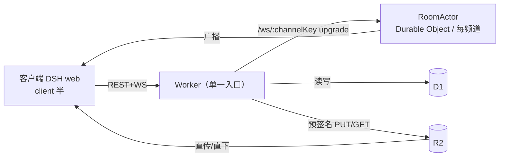

# dsh-talk 产品需求文档（PRD）

| 项 | 内容 |
| --- | --- |
| 文档版本 | v0.2（评审中；M0 预研后冻结 MVP 范围） |
| 变更记录 | v0.1 初稿；v0.2 采纳「类似 Discord：允许用户自行创建社区」——Hub 由「单实例=单社区」演进为「单 Hub=平台，承载多个社区（Discord「服务器」语义）」，频道归属社区 |
| 关联文档 | [README](../README.md) |
| 配套版本 | DSH `0.1.2-rc.1`（实测）/ 脚手架 peer `0.1.3-alpha.2`；Cordis `4.0.2` |

> 本文档的 API/机制事实基于对已安装 DSH（`@deepseek-ai/*`，版本 0.1.2-rc.1）只读调研；标注「⚠️ M0 验证」的条目存在证据缺口或实现不确定性，由里程碑 M0 的预研（§14）裁决，不得在 MVP 中假设其成立。

---

## 1. 背景与问题

DSH（DeepSeek Harness）用户与开发者社区目前的协作方式割裂：

- **上下文断裂**：遇到问题要切到 Discord / 微信群 / 论坛，报错、截图、会话内容来回搬运，离开 DSH 后语境丢失。
- **复现成本高**：「这个会话为什么这样」难以描述；对方无法低成本获得**完整一致的会话轨迹**，只能靠口述 + 截图。
- **成果难分发**：写好的 workflow 没有标准载体，无法像「一键安装」一样复用。
- **反馈回路慢**：没有结构化的求助/解答闭环（提问 → 解答 → 已解决）。

### 1.1 产品一句话

**dsh-talk 是一个类 Discord 的社区插件：任何注册用户都能自行创建/加入多个社区，在 DSH 内完成闲聊、求助解答、工作流分享，并把任意一条完整 Agent 会话「一键克隆」到对方本地——全程不跳出 DSH。**

### 1.2 用户原话（整理）

> 「这是一个 dsh 社区插件：聊天 + 允许分享 dsh 的工作流……让 DSH 的用户们或开发者们可以沟通闲聊的地方，而不用跳出 DSH。」
>
> 「分享后，下一个用户点击，会创建一个一模一样的会话，记录和整个轨迹也完全一样，就是 clone 一个到另一个人的本地上。」
>
> 「也思考一下 Discord 类似的，可以让开发者们不跳出的情况下，解决社区问题。」
>
> 「类似 Discord，允许用户自行创建社区。」

---

## 2. 目标与非目标

### 2.1 MVP 目标

1. **G1 聊天**：在 DSH 内提供类 Discord 的实时频道聊天，无需跳出 DSH。
2. **G2 求助闭环**：`#help` 中提问可被解答并由作者标记「已解决」。
3. **G3 会话一键克隆**：分享一条完整会话（记录 + 整个轨迹 + 附件），他人点击后在**本地**生成内容完全一致的会话副本（可查看，具备继续对话能力为 P1 加分项，受 §14 R2 门禁约束）。
4. **G4 工作流分发**：分享 workflow（纯 JSON 载荷 `{meta, script, args}`），他人可在本地运行副本。
5. **G5 自托管 Hub**：服务端随仓库交付，可本地 `wrangler dev`，可一键部署到 Cloudflare（Workers + Durable Objects + D1 + R2），云端资源零第三方依赖。
6. **G6 社区自治**：任何注册用户可自行创建社区（Discord「服务器」语义）并作为 owner 管理频道、邀请码与可见性；社区可公开被「发现」加入，也可私有 + 邀请码加入。

### 2.2 非目标（MVP 明确不做）

- 私信（DM）、好友关系与跨社区社交图谱。
- 复杂角色/权限体系：社区内 MVP 仅 `owner` / `member` 两级；频道创建/归档、资料编辑、邀请码管理限 owner；平台级运营后台（跨社区封禁等）P1 提供。
- 发现目录的搜索/分类/推荐，以及置顶公告、社区图标自定义等「服务器」进阶能力（P1/P2）。
- 全文搜索、消息编辑、引用回复、表情回应、线程折叠视图、typing 指示器。
- Agent 自动答疑/自动发帖（工具预留，P1）。
- 端到端加密、自动敏感词审核（仅人工举报 + owner 移除成员，P1 完善）。
- 官方公网实例的运营（仓库只交付可自托管代码与部署文档；默认 `hubUrl` 为本地）。
- 移动端 / 非 DSH 平台接入。
- 非 Cloudflare 的云资源（按用户要求，云端一律 Cloudflare）。

### 2.3 成功指标（MVP 上线后观测，先定性后定量）

| 指标 | 定义 | 目标（内测期参考） |
| --- | --- | --- |
| 周活跃发帖用户 | 7 天内有发言的已注册用户 | 内测群 ≥ 60% |
| 求助解决率 | `#help` 提问中 7 天内被标记 resolved 的比例 | ≥ 70% |
| 克隆次数 / 会话分享数 | 比值 | ≥ 1.5 |
| 会话内解决 | 用户在 DSH 会话中引用社区解答后返回社区确认 | 定性观察 |
| 跳出率 | 会话过程中切到外部社区工具的频次（用户访谈） | 下降 |
| 社区自建活跃 | 新建社区 7 天存活且有发言的比例；发现目录加入转化 | 内测观察 |

---

## 3. 用户与场景（User Stories）

| # | 用户 | 故事 |
| --- | --- | --- |
| US-1 | 普通用户 | 我在 `#general` 看到大家聊新版本，直接在 DSH 里回复代码片段（带语法高亮）。 |
| US-2 | 求助用户 | 我的会话卡在一个工具报错，我在 `#help` 发一条「提问」，贴上轨迹与报错；别人回答后我标记已解决，其他人能看到 ✅。 |
| US-3 | 解答者 | 我看到一个求助帖，想真正复现问题：点帖子里的**克隆按钮**，本地出现一份和提问者一模一样的会话，我打开就能分析、甚至直接操作到出错的步骤。 |
| US-4 | 分享者 | 我调好了一个 workflow，在 `#showcase` 发「分享工作流」卡片，附标题、说明与脚本；别人点开预览后一键在本机运行。 |
| US-5 | 分享者（会话） | 我跑完一条高质量会话，从会话操作区点「分享到社区」，选择要包含的子会话/附件，发布成克隆卡片。 |
| US-6 | 平台运营 | 我通过平台注册码发放入场资格；平台级封禁等治理在 P1 提供管理 API；公告由各社区 owner 发在自己社区的 `#announcements`。 |
| US-7 | 开发者 | 我本地只有插件没有 Hub：克隆仓库后 `wrangler dev` 起 Hub + 起 DSH，两个 profile 即可联调。 |
| US-8 | 社区创建者（owner） | 我在「创建社区」里起名、写简介并设为公开：它立刻出现在「发现」目录，朋友们可直接加入；我再拉个 `#weekly` 频道沉淀周会。 |
| US-9 | 加入者 | 我在「发现」里逛公开社区一键加入，或输入朋友给的社区邀请码加入私有社区；随时可以退出。 |
| US-10 | 团队 owner | 我把自己团队的社区设为私有并生成邀请码；不想外人再进时撤销旧码。 |

---

## 4. 术语表

| 术语 | 说明 |
| --- | --- |
| Hub | 社区平台服务端（Cloudflare Workers 部署，仓库内 `server/`）；**一个 Hub 承载多个社区**。 |
| 社区（community） | Discord「服务器」语义：一组频道 + 成员的容器；由注册用户自行创建，创建者即 owner。 |
| owner / member | 社区内两级角色：owner 可管理频道、资料、邀请码与成员；其余为 member。 |
| 注册码 / 社区邀请码 | 平台注册码（`AUTH_INVITE_CODES`）只用于开通账号；社区邀请码由 owner 生成，用于加入私有社区。 |
| 发现目录（discover） | 公开社区的浏览列表（名称/描述/成员数/owner），可直接加入。 |
| DSH | DeepSeek Harness；本文以实测 `0.1.2-rc.1` 为基准。 |
| 会话（session） | DSH 中一次 Agent 工作会话，持久化为 JSONL 事件流（`session.jsonl`，可能 zstd 压缩）。 |
| 轨迹（trajectory） | 会话记录中的完整事件序列（消息、工具调用、结果、子会话等）。 |
| 克隆包（clone payload） | 可分享的会话存档 zip：`manifest.json` + `session.jsonl`（明文）+ `attachments/*`（可选）+ 子会话。 |
| workflow | DSH workflow：一段 JS 编排脚本，载荷 `{meta, script, args}`；官方不支持持久化/导入导出，dsh-talk 自行承载。 |
| 双半包（dual-half） | DSH 客户端插件形态：同一 npm 包含 host 半（Node）与 `./client` 浏览器半，`dsh.client` 声明被 client modules 扫描进 `window.__DSH_BOOT__`。 |
| slot | DSH Web GUI 的 UI 组合机制（`ctx.slots.register / inject`），第三方 UI 通过占用/声明孔位挂载。 |

---

## 5. MVP 功能需求

> 优先级：**P0**（必须，进入验收） / **P1**（应有，视 M0 门禁后的人力放入 MVP 尾部或立即排入 v0.2）。

### A. 接入与身份（FR-A）

| ID | 需求 | 优先级 | 验收标准（AC） |
| --- | --- | --- | --- |
| FR-A1 | 注册身份：输入**平台注册码** + 昵称，Hub 校验后返回不透明令牌，自动写入本地设置（注册码仅用于开通账号；加入具体社区走 FR-G） | P0 | ① 错误注册码得到明确报错；② 成功后设置页可见令牌（secret 态）；③ 注册码单次使用，二次使用被拒 |
| FR-A2 | 断线/重启后自动恢复身份，无需重新输入 | P0 | 重启 DSH 后面板直接可用 |
| FR-A3 | 提供「离开社区/重置身份」入口 | P1 | 本地令牌清除，Hub 端可后台作废 |
| FR-A4 | `announcements` 类型频道仅社区 owner 可发言；平台级管理员（`ADMIN_HANDLES`）用于平台治理（P1 提供管理 API） | P1 | 非 owner 在 announcements 发言被 403 |

### B. 频道与消息（FR-B）

| ID | 需求 | 优先级 | 验收标准（AC） |
| --- | --- | --- | --- |
| FR-B1 | 新社区创建即生成默认频道模板：`announcements` `general` `showcase` `help` `random`（owner 随后可按 FR-G6 增删）；频道 `key` 在**社区内**唯一，列表按服务端顺序渲染 | P0 | 新社区创建后可见默认频道；两个社区可有同名频道互不干扰 |
| FR-B2 | 实时收发：进入频道即建立 WS 订阅；服务端广播新消息，所有在线用户 ≤2s 内收到 | P0 | 双用户互发，双端可见（本地 Hub + 双 profile 联调） |
| FR-B3 | 历史分页：向上滚动按 `before=<id>` 拉取，每页 50 条 | P0 | 翻到最旧消息不再请求 |
| FR-B4 | 断线重连：指数退避自动重连，重连后按 `last_seen_id` 补齐缺口 | P0 | kill -9 Hub 或断网 30s 恢复后消息不丢不重 |
| FR-B5 | 消息渲染：Markdown + 围栏代码块语法高亮；长度上限 4000 字符（服务端强制） | P0 | 超长被拒并提示 |
| FR-B6 | 图片附件：≤10 MiB，经 R2 预签名直传，消息内预览 | P0 | 上传失败可重试；预览可点开大图 |
| FR-B7 | 其他文件附件 | P1 | 同 FR-B6，大小上限 50 MiB |
| FR-B8 | `@handle` 提及：解析、高亮；被提及者得到高亮提示（红点语义，见 FR-N） | P0 | 发 `@bob …`，bob 侧有新提及提示 |
| FR-B9 | 消息删除（自己/管理员，软删显示「消息已删除」） | P1 | 删除后双方不可见正文 |
| FR-B10 | 消息编辑、引用回复、表情回应、typing 指示器 | P1 | — |

### C. #help 求助闭环（FR-C）

| ID | 需求 | 优先级 | 验收标准（AC） |
| --- | --- | --- | --- |
| FR-C1 | `#help` 内可发「提问」消息（带问题标题/描述 + 可选「附上当前会话」链接） | P0 | 提问消息在列表有「求助」样式 |
| FR-C2 | 作者可将自己的提问标记「已解决」（可再取消） | P0 | 标记后消息出现 ✅，社区可见 |
| FR-C3 | 被标记解决后，提问者可补充「最佳答案引用」（选择一条回复） | P1 | 展示在提问下 |

### D. 分享与一键克隆（FR-D）—— 核心差异化，详见 §6 §7

| ID | 需求 | 优先级 | 验收标准（AC） |
| --- | --- | --- | --- |
| FR-D1 | 从当前会话发起「分享会话」：确认框展示包含项（子会话/附件清单）、体积、隐私提示（§12），发布到**当前所在社区的**指定频道（默认 `#showcase`） | P0 | 分享成功生成卡片消息；体积超上限被拒 |
| FR-D2 | 分享 workflow：粘贴脚本（JS）+ meta（name/description/phases），可选最近一次 `workflow` 工具调用记录自动带入 | P0 | 结构预检（仅语法/形状，不执行）；成功生成卡片 |
| FR-D3 | 卡片展示：作者、标题、说明、类型徽章（`会话克隆` / `workflow`）、体积、时间、克隆/运行次数 | P0 | — |
| FR-D4 | **一键克隆会话**：点击 → 预览 → 确认 → 下载并校验 → 本地生成内容一致的新会话 → 自动打开 | P0*（*受 R2 门禁，§14） | 见 §6.3 验收列表 |
| FR-D5 | 运行他人 workflow：点击 → 预览（含脚本）→ 确认 → 在本地执行副本 | P0*（*受 R2 门禁） | 见 §7.3 |
| FR-D6 | 克隆/运行结果计数回写 Hub（`clone_count`） | P0 | 卡片数字 +1 |
| FR-D7 | 分享者删除自己的分享 | P1 | 卡片隐藏、R2 对象删除 |

### E. 通知与未读（FR-E）

| ID | 需求 | 优先级 | 验收标准（AC） |
| --- | --- | --- | --- |
| FR-E1 | 每频道未读计数：`last_read_message_id` 与服务端最近消息比对 | P0 | 切走频道再回来，徽章正确增减 |
| FR-E2 | 新提及（`@handle`）时频道红点高亮为「提及」样式 | P0 | 见 FR-B8 |
| FR-E3 | 系统通知（Web Notification，可选开启） | P1 | 面板外收到新消息提醒 |
| FR-E4 | 未读跨设备同步（服务端 `channels_reads` 表） | P1 | 另一设备打开后未读一致 |

### F. 系统与配置（FR-F）

| ID | 需求 | 优先级 | 验收标准（AC） |
| --- | --- | --- | --- |
| FR-F1 | 设置项（§11 配置表）可在 DSH 设置页修改并即时生效 | P0 | 改 `hubUrl` 后重连新地址 |
| FR-F2 | 加载态、错误态、空态覆盖主要路径；WS 断开有明显提示条 | P0 | 断网时 UI 可见「已断开，重连中…」 |
| FR-F3 | 键盘可达（焦点顺序、回车发送、`Shift+Enter` 换行） | P1 | 主要路径纯键盘可完成 |
| FR-F4 | i18n：UI 文案 `zh` / `en` 双语言包（`ctx.locale.register('talk', …)`） | P1 | 切换语言 UI 随动 |
| FR-F5 | 本地诊断：面板可查看连接状态、最近错误、令牌有效性 | P1 | 便于工单排查 |
| FR-F6 | 遥测（可选）：Hub 侧基础指标（消息数、WS 在线、R2 用量） | P1 | 见 §13 |

### G. 社区：自建 / 发现 / 加入 / 管理（FR-G）

> 对应 G6：任何注册用户可创建社区；社区内两级角色（owner / member）；公开社区进「发现」目录，私有社区凭 owner 生成的社区邀请码加入。

| ID | 需求 | 优先级 | 验收标准（AC） |
| --- | --- | --- | --- |
| FR-G1 | 创建社区：名称（≤60）、描述（≤400）、可见性（默认 `public`）；创建即生成默认频道模板（FR-B1），创建者为 owner；受建社区限流（§8.4） | P0 | ① 注册用户可创建；② 新社区出现在「我的社区」并可进入默认频道；③ 超限/非法输入被拒并提示 |
| FR-G2 | 「我的社区」列表与切换（每社区独立的频道树与未读状态） | P0 | 多社区切换后频道与未读正确；退出/加入后列表即时更新 |
| FR-G3 | 发现公开社区：分页目录（名称/描述/成员数/owner/创建时间） | P0 | 新创建的公开社区可被发现并一键加入 |
| FR-G4 | 加入：公开社区直接加入；私有社区输入社区邀请码加入 | P0 | 非成员访问频道被 403；退出后凭有效邀请码可重入；无效码明确报错 |
| FR-G5 | owner 生成/撤销社区邀请码（私有社区必用；撤销后旧码立即失效） | P0 | 非 owner 调用被 403；撤销后使用旧码加入失败 |
| FR-G6 | owner 新建频道（`key`/显示名/类型） | P0 | 非 owner 被 403；同名 `key`（社区内）被拒 |
| FR-G7 | owner 归档频道、编辑社区资料（名称/描述/可见性）、归档社区 | P1 | 归档后对成员只读（社区归档后整体下线，owner 可恢复） |
| FR-G8 | 退出社区（member/owner 均可）；owner 移除/封禁成员 | 退出 P0 / 移除 P1 | 被移除/封禁者立即失去访问（含 WS 断开） |
| FR-G9 | 社区级未读聚合与「提及我」提示（跨频道汇总） | P1 | 社区抽屉红点 = 该社区各频道未读之和 |

---

## 6. 「会话一键克隆」规格（核心差异化）

### 6.1 分享侧

**入口**：当前会话的操作区/`/share` 命令 → 打开「分享会话」对话框。

**分享前确认（必选，含隐私）**：

- 展示将包含的内容摘要：`会话标题 / turn 数 / 工具调用数 / 子会话数 / 附件清单与总大小`；
- 复选框「包含附件」（默认**不勾选**，勾选需二次确认）；
- 警示文案：轨迹可能包含 prompt、文件路径、工作区内容，请勿携带密钥；建议先脱敏；
- 选择目标频道与填写标题、说明。

**打包（在本地完成，避免隐私内容先经第三方）**：

```
dsh-session-<sourceId>-share.zip
├── manifest.json        # 见 §6.4
├── session.jsonl        # 明文 JSONL（如源为 zstd，解压为明文，保证跨版本可读）
├── sessions/<childId>.jsonl   # 子会话（递归，可选）
└── attachments/<sha256>.<ext> # 附件原文件（可选）
```

- 打包复用/对齐 DSH 导出语义（`dsh-session-log-export` 的 `dsh-session-<id>.zip`：session + 子会话 + attachments；其导出为浏览器下载，dsh-talk 的 host 半在本地直接生成 zip，不走浏览器下载）。
- zip 计算 `sha256`；上传走 R2 预签名 PUT（两段式：先建 share 记录 → 直传 → `complete` 后置 ready 并落一条卡片消息，见 §9）。

### 6.2 接收侧：一键克隆

**点击卡片「克隆到本机」→ 确认对话框：**

- 展示：作者、标题、说明、`DSH 源版本`、turn 数、附件大小、来源链接；
- 工作区选择：默认「新建目录 `talk-clones/<title>/`」，可改为现有工作区（⚠️ 提醒：克隆会话中的相对路径/文件引用以该工作区为准）；
- 明确告知：将**在本机新建一个会话**，其记录与轨迹与源一致；如需继续对话，是在副本上继续（fork 语义，能力受 R2 门禁）。

**克隆流程（host 半执行，全部本地）：**

1. 下载预签名 URL → 校验 `sha256` 与 `manifest.schemaVersion` 兼容（不兼容则拒绝并给出升级提示）；
2. 解压到临时目录；逐项校验附件哈希与清单一致；
3. 向 DSH 会话持久化/索引层写入新会话（布局对齐 `dsh-session-persistence-jsonl`：`<storageRoot>/--<normalized-cwd>--/<newId>/session.jsonl` + attachments；并在会话列表/查询索引中注册，使其像本地会话一样出现）—— ⚠️ M0 验证（R2）：安装副本无公开「导入 JSONL 恢复会话」API，需在 M0 以直接写盘 + 索引注册做可行性实验；
4. 成功后：跳转到新会话视图；在 dsh-talk 本地映射表（domain `talk`）记录 `localSessionId ↔ {originShareId, author, clonedAt}`，供「来源」展示；
5. 回写 Hub `clone_count +1`（FR-D6）。

### 6.3 验收（Go 判据，M0 后全量跑）

1. 源端 `alice` 分享含 2 个子会话 + 1 张图片的会话；
2. 接收端 `bob` 克隆：新会话在会话列表中可见、可打开；
3. **逐事件比对**：将源 JSONL 与克隆 JSONL 归一化（仅 id/时间戳/路径前缀替换）后内容一致 → 「记录与整个轨迹完全一样」判据；
4. bob 可继续在副本上发送消息（fork）→ 若 R2 判定不可行，则降级为「只读档案 + 从尾事件续开新会话」，并**明确写入 PRD 变更记录**，不静默降级；
5. 附件正确落盘且被会话引用可预览；
6. 克隆期间取消/断网不产生半成品会话（幂等：可重试，成功前不注册进会话列表）。

### 6.4 manifest.json（schemaVersion: 1）

```json
{
  "schemaVersion": 1,
  "kind": "session-clone",
  "source": {
    "dshVersion": "0.1.2-rc.1",
    "sessionId": "<sourceSessionId>",
    "title": "<会话标题>",
    "cwd": "<归一化的源工作目录>",
    "exportedAt": "2025-01-01T00:00:00Z"
  },
  "content": {
    "turnCount": 23,
    "childSessionCount": 2,
    "hasAttachments": true,
    "attachmentCount": 1,
    "totalBytes": 1823456,
    "checksumSha256": "<zip sha256>"
  }
}
```

---

## 7. 「workflow 分享/运行」规格

### 7.1 可分享工件

DSH workflow 官方无持久化、无导入导出、不可恢复（调研结论：`dsh-workflow` 为一次运行语义，`{meta, script, args}` 即最小单元）。故：

- **工件 = `{meta, script, args}`**，其中 `meta` 与 DSH `WorkflowMeta` 对齐（`name`（短横线）、`description`、`whenToUse?`、`phases?: {title, detail?, provider?, model?}[]`），`script` 为 JS 编排脚本（top-level await，`return <json>`），`args` 可选入参。
- 服务端**只存不执行**（存 D1 元数据 + R2 文本对象），Hub 侧无脚本执行面，杜绝经由分享的 RCE。

### 7.2 分享侧

「分享工作流」对话框：粘贴 `meta`+`script`（或从「最近一次 `workflow` 工具调用」记录带入，P1）→ 本地形状预检（meta 字段、script 非空、`return` 存在性提示，不执行）→ 发布为 `kind: workflow` 卡片。

### 7.3 接收侧：运行

点击卡片「在本机运行」→ **预览**（meta、phases、脚本全文、行数、入参 schema）→ 显式确认 → 执行：

- **执行通道（推荐）**：通过 DSH 的「受信外部事件 → 新建 Workspace 会话并注入初始 prompt」通道（与 `dsh-webhook` 的 `WebhookSessionRequest` 同构：`{workspacePath, title, prompt, …}`），prompt 要求本地 agent 依据所附脚本文件执行 `workflow` 工具 —— 全程走既有 agent 权限/审批策略，脚本**不会**被静默执行。⚠️ M0 验证（R3）：`ctx.workflowEngine.start` 需要 `parent` Agent 绑定，插件进程内无法凭空提供，故优先走「新建会话委派」；备选为「复制脚本」按钮（纯文本导出，零执行）。
- 结果说明：模型非确定性 → 卡片文案明确「运行的是**副本**，输出可能与原作者不同」；运行记录留在本机，与分享内容无耦合。
- 确认要求：任何执行路径都须**用户逐次确认**，且复用 DSH 的审批/权限预设（approval/preset），禁止后台自动跑他人脚本。

---

## 8. 服务端设计（Cloudflare Hub）

### 8.1 拓扑



### 8.2 选型与理由

| 组件 | 用途 | 理由 |
| --- | --- | --- |
| Cloudflare Workers | 全部 HTTP/WS 入口 | 无服务器、全球边缘、零第三方依赖 |
| Durable Objects（RoomActor） | 每频道一个：持有 WS 连接、presence、广播；支持 WS Hibernation | 实时语义的唯一有状态点；单频道广播局部化 |
| D1（SQLite） | **元数据源真**：用户/社区/成员/频道/消息/分享/注册码与社区邀请码/读取游标 | 强一致 + 好查询；MVP 规模（≤10⁴ 用户、≤10³ 社区、≤5×10⁵ 消息、7 天保留）远低于限额 |
| R2 | 图片附件与克隆包/workflow 文本 | 便宜的对象存储；预签名 URL 直传直下，Worker 不中转大文件 |
| KV | （可选）注册码/社区邀请码与限流计数缓存 | P1；MVP 可不用 |
| 队列 / Vectorize / Analytics Engine | 异步任务、语义搜索、指标 | P2 |

> **关键约束**：DO 的 WebSocket 需用 **Hibernation API**（`state.acceptWebSocket` + 事件驱动），降低空闲连接成本；D1 写入频率按每频道秒级量级设计（先落 D1 再广播，读多写少）。

### 8.3 部署单元（server/ 布局见 README）

- `wrangler.toml`：`main = src/worker.ts`；bindings：`[[durable_objects.bindings]] name="ROOM"`、`[[d1_databases]]`、`[[r2_buckets]]`（bucket：`talk-attachments` / `talk-shares`，或单 bucket 按前缀）。
- 环境：`dev`（本地 wrangler dev，`hubUrl=http://127.0.0.1:8787`）/ `prod`（`wrangler deploy`，自定义域名 + HTTPS）。
- CI 发布 GitHub Actions（P1）。

### 8.4 认证与会话（MVP）

- **两级邀请体系**：① **平台注册码**（`AUTH_INVITE_CODES`，仅用于开通账号、单次使用）：`POST /api/auth/invite {code, handle}` → 创建 `user`（`handle` 唯一）并返回不透明令牌（`uuid`，库中仅存 `sha256(token)` 哈希）；② **社区邀请码**由社区 owner 生成（`POST /api/communities/:id/invites`），用于加入私有社区。任何已注册用户都可创建公开/私有社区（受 §12 建社区限流约束）。
- **社区鉴权**：两级校验——请求用户须为「目标频道所属社区的 member」（社区 owner 即 member）；社区级资源（资料、成员、邀请码、频道管理）校验 owner 角色。所有 `/api/*` 与 WS 升级统一走该中间件。
- 请求鉴权：`Authorization: Bearer <token>`；所有 `/api/*` 与 WS 升级均校验。
- 限流（滥用防护）：按用户/分钟（DO 内存计数 + 兜底）、消息频率（≥1s/条）、单分享大小（`MAX_SHARE_BYTES`）、单条长度（`MAX_MESSAGE_LENGTH`）、建社区频率（默认 3 个/日、累计 ≤10 个，见 §12）。
- CORS：Hub 域名独立于 DSH Web（`http://127.0.0.1:3080` 等），对浏览器访问开放 CORS 白名单 + Bearer 鉴权兜底；WS 同源策略由 Worker 校验 Origin（可选关闭）。

### 8.5 实时（WS）设计要点

- 连接：`GET /ws?channel=<channelId>&cursor=<lastSeenId>` → **先校验用户为该频道所属社区的 member** → upgrade 到频道对应 RoomActor。
- 心跳：Server ping 25s；>60s 无 pong 断开。
- 消息路径：REST `POST /messages` 落 D1 → Worker 通知 RoomActor → 广播 `message.new`（写穿模式，保证「先持久后广播」）。
- 补漏：重连后以 `cursor` 通过 REST 拉缺口（7 天保留），不依赖 WS 可靠投递。
- 事件协议见 §10。

---

## 9. D1 数据模型（草案）

```sql
users(
  user_id      TEXT PRIMARY KEY,          -- uuid
  handle       TEXT UNIQUE NOT NULL,
  token_hash   TEXT NOT NULL,             -- sha256(token)
  role         TEXT NOT NULL DEFAULT 'user', -- 'user' | 'admin'
  status       TEXT NOT NULL DEFAULT 'active', -- 'active' | 'banned'
  created_at   INTEGER NOT NULL
);

-- 平台注册码（仅用于开通账号；加入私有社区走 community_invites）
invites(
  code         TEXT PRIMARY KEY,
  used_by      TEXT,                      -- users.user_id
  used_at      INTEGER,
  expires_at   INTEGER
);

communities(
  community_id TEXT PRIMARY KEY,
  name         TEXT NOT NULL,             -- ≤60 字符
  description  TEXT,                      -- ≤400 字符
  owner_id     TEXT NOT NULL,             -- users.user_id
  visibility   TEXT NOT NULL DEFAULT 'public', -- 'public' | 'private'
  archived_at  INTEGER,                   -- owner 归档（P1）
  created_at   INTEGER NOT NULL
);

community_members(
  community_id TEXT NOT NULL,
  user_id      TEXT NOT NULL,
  role         TEXT NOT NULL DEFAULT 'member', -- 'owner' | 'member'
  joined_at    INTEGER NOT NULL,
  PRIMARY KEY (community_id, user_id)
);

community_invites(
  community_id TEXT NOT NULL,
  code         TEXT NOT NULL,             -- 由 owner 生成
  created_by   TEXT NOT NULL,
  revoked_at   INTEGER,
  expires_at   INTEGER,
  PRIMARY KEY (community_id, code)
);

channels(
  channel_id   TEXT PRIMARY KEY,
  community_id TEXT NOT NULL,             -- 频道归属于社区
  key          TEXT NOT NULL,             -- 社区内唯一：'general' | 'help' | ...
  name         TEXT NOT NULL,             -- 显示名
  kind         TEXT NOT NULL DEFAULT 'chat', -- 'chat' | 'announcements'
  position     INTEGER NOT NULL DEFAULT 0,
  archived_at  INTEGER,
  UNIQUE (community_id, key)
);

messages(
  message_id   TEXT PRIMARY KEY,
  channel_id   TEXT NOT NULL,
  user_id      TEXT NOT NULL,
  kind         TEXT NOT NULL,             -- 'text' | 'question' | 'share' | 'system'
  body         TEXT,                      -- markdown 正文（share 消息可为空）
  share_id     TEXT,                      -- kind='share' 时指向 shares
  resolved_at  INTEGER,                   -- kind='question' 时作者标记
  attachment_ids TEXT,                    -- JSON 数组（图片等）
  created_at   INTEGER NOT NULL,
  edited_at    INTEGER,
  deleted_at   INTEGER                    -- 软删
);
CREATE INDEX idx_messages_channel ON messages(channel_id, created_at DESC);
CREATE INDEX idx_members_user ON community_members(user_id, community_id);
CREATE INDEX idx_communities_discover ON communities(visibility, created_at DESC);

shares(
  share_id     TEXT PRIMARY KEY,
  kind         TEXT NOT NULL,             -- 'session-clone' | 'workflow'
  author_id    TEXT NOT NULL,
  channel_id   TEXT NOT NULL,
  title        TEXT NOT NULL,
  description  TEXT,
  r2_key       TEXT NOT NULL,             -- talk-shares/<shareId>.zip / .txt
  size_bytes   INTEGER NOT NULL,
  checksum_sha256 TEXT NOT NULL,
  manifest     TEXT,                      -- manifest.json 摘要（JSON，供预览）
  status       TEXT NOT NULL DEFAULT 'uploading', -- 'uploading'|'ready'|'deleted'
  clone_count  INTEGER NOT NULL DEFAULT 0,
  created_at   INTEGER NOT NULL
);

channel_reads(                          -- P1 跨设备未读；MVP 客户端本地为主
  user_id      TEXT NOT NULL,
  channel_id   TEXT NOT NULL,
  last_read_message_id TEXT NOT NULL,
  PRIMARY KEY (user_id, channel_id)
);
```

> 保留策略：消息/分享 7 天滚动（MVP 起保留全量亦可，D1 配额内）；删除采用软删 + R2 对象异步清理。

---

## 10. 消息协议 v1（草案）

### 10.1 WS 事件（JSON，每行一个对象）

```jsonc
// 客户端 → 服务端
{ "op": "ping", "ts": 1735689600000 }
// 服务端 → 客户端
{ "op": "hello", "data": { "channelId": "c_help", "serverTime": 1735689600000 } }
{ "op": "message.new", "data": {
    "message": {
      "id": "m_9f2c", "channelId": "c_help", "author": { "id": "u_1", "handle": "alice" },
      "kind": "question", "body": "workflow 工具报错：`Execution failed`，有人遇到过吗？",
      "resolvedAt": null, "attachments": [], "createdAt": 1735689601000 } } }
{ "op": "share.new", "data": { "message": { /* kind:'share' 的 message.new 之上叠加 share 摘要 */ },
    "share": { "id": "s_77", "kind": "session-clone", "title": "复现：多文件编辑冲突", "sizeBytes": 1823456 } } }
{ "op": "question.resolved", "data": { "messageId": "m_9f2c", "resolvedAt": 1735689602000 } }
{ "op": "message.deleted", "data": { "messageId": "m_x" } }          // P1
{ "op": "reaction.add", "data": { "messageId": "m_y", "emoji": "👍" } } // P1
{ "op": "presence.join", "data": { "userId": "u_1", "handle": "alice" } }
{ "op": "presence.leave", "data": { "userId": "u_1" } }
{ "op": "error", "data": { "code": "rate_limited", "message": "消息太频繁，请稍后再试" } }
{ "op": "pong", "ts": 1735689600000 }
```

### 10.2 REST（摘要）

| Method | Path | 说明 |
| --- | --- | --- |
| POST | `/api/auth/invite` | 平台注册：`{code, handle}` → `{token, user}` |
| GET | `/api/bootstrap` | 当前用户、我加入的社区（含各社区频道与读取游标）、能力开关 |
| POST | `/api/communities` | 创建社区：`{name, description?, visibility?}` → 社区 + 默认频道（owner=当前用户） |
| GET | `/api/communities/mine` | 我加入的社区（含频道与角色） |
| GET | `/api/communities/discover?cursor=` | 公开社区目录（分页：名称/描述/成员数/owner） |
| GET | `/api/communities/:id` | 社区详情（非成员仅限公开摘要） |
| POST | `/api/communities/:id/join` | 加入：`{inviteCode?}`（私有社区必填） |
| DELETE | `/api/communities/:id/membership` | 退出社区 |
| POST | `/api/communities/:id/invites` | owner 生成社区邀请码 |
| DELETE | `/api/communities/:id/invites/:code` | owner 撤销社区邀请码 |
| POST | `/api/communities/:id/channels` | owner 新建频道：`{key, name, kind?}` |
| PATCH | `/api/communities/:id` | owner 编辑资料/可见性/归档（P1 完整） |
| GET | `/api/channels/:id/messages?before=&limit=` | 历史分页（≤50） |
| POST | `/api/channels/:id/messages` | 发消息：`{kind:'text'\|'question', body, attachmentIds?}` |
| POST | `/api/channels/:id/reads` | `{lastMessageId}`（P1 全量启用） |
| POST | `/api/shares` | 建分享：`{kind, title, description, channelId, manifest}` → `{shareId, uploadUrl}`（R2 预签名 PUT，有效期 15min） |
| POST | `/api/shares/:id/complete` | 上传完成后置 `ready`，落卡片消息（同时广播 `share.new`） |
| GET | `/api/shares/:id` | 元数据 + manifest 摘要（供预览，含 workflow 脚本全文——接收者本地执行，需二次确认） |
| GET | `/api/shares/:id/download` | 302/返回 R2 预签名 GET（10min） |
| POST | `/api/questions/:messageId/resolve` | 作者标记/取消 resolved |
| DELETE | `/api/messages/:id` | 删自己的消息（软删） |
| PUT | `/api/me/handle` | 改昵称（P1） |

> 上传图片：`POST /api/uploads/image`（multipart 或预签名）→ `{attachmentId, url}`，消息携带 `attachmentIds`；MVP 图片 ≤10 MiB。

---

## 11. 客户端插件设计（DSH 集成）

### 11.1 双半包

| 半 | 职责 | 关键注入/API（调研所得，M0 复核） |
| --- | --- | --- |
| host 半 | 配置 `ctx.settings.register('talk', Schema, {base})`；克隆恢复器（写会话持久化/索引）；workflow 运行通道；本地缓存 `ctx.storageDomain.open(defineDomain({name:'talk', …}))`；tools（P1：`talk_search`、`talk_post`） | `ctx.settings`、`ctx.storageDomain`、`ctx.webhookRuntime`（复用其「新建会话」通道，R3） |
| client 半 | 聊天 UI、Hub WS 长连接、未读/提及、分享表单与预签名直传、克隆/运行对话框、来源映射展示 | `ctx.slots`（`ctx.slots.register` / `ctx.slots.inject`）、`ctx.locale`、`ctx.settingsScope`、`ctx.remote`（host RPC） |

### 11.2 UI 集成点（M0 复核具体孔位契约）

- **入口**：占用 DSH 侧栏孔（参考锚点：`sidebar.footer.action` 列表槽），点击打开 **Talk 面板**（复用 shell 提供的 overlay/page 容器能力，具体以 `dsh-client-web` shell 为准；⚠️ R1：`dsh-client-ui-slots` / `dsh-client-web` 未随安装包发布，须源码核对）。
- **设置**：占用 `settings.section` 提供 `talk` 设置区（hubUrl / 昵称 / 令牌 / 上限 / 语言）。
- **会话分享入口**：会话操作区（位置以 R1 核对的可用孔位/API 为准）。
- **语言**：`ctx.locale.register('talk', {zh, en}, …)` + `addLanguage` 按需。

### 11.3 面板页面流转

```
社区抽屉（我的社区 / 发现 / 创建社区，社区级未读聚合）
  └─ 社区内频道列表（未读/提及徽章）
       └─ 频道消息区（历史 + 实时流 + 提问/分享卡片样式）
            ├─ 输入区（Markdown / 图片 / @提及）
            ├─ 「分享会话」对话框（确认 + 打包 + 上传）
            ├─ 「分享工作流」对话框（粘贴/带入 + 预检 + 上传）
            ├─ 「克隆到本机」对话框（预览 + 工作区选择 + 执行）
            └─ 「在本机运行」对话框（workflow 预览 + 确认执行）
owner 操作（member 不显示）：新建/归档频道、生成/撤销邀请码、编辑社区资料
```

### 11.4 本地缓存（domain `talk`）

`profile`（handle/token 镜像）、`session-clone-meta`（localSessionId ↔ 分享来源映射）、`drafts`（输入草稿）、`lastRead`（每频道游标，断网可离线读最近缓存）。

---

## 12. 安全、隐私与合规

| 主题 | MVP 处置 | 责任方 |
| --- | --- | --- |
| 传输安全 | 全站 HTTPS/WSS（Cloudflare）；本地 dev 走 HTTP 属例外并明示 | Hub |
| 静态安全 | D1/R2 由 Cloudflare 静态加密 | Cloudflare |
| 令牌 | 不透明 uuid；服务端只存哈希；本地以 secret 设置保存；泄露可后台作废（P1 提供 UI） | 双方 |
| 克隆包内容 | **含用户完整轨迹（prompt、文件路径、工具调用）**：默认不含附件；分享前强制展示内容摘要与警示；建议脱敏后再分享 | 用户 |
| 不可信输入 | 下载后校验哈希/清单；JSONL 仅作只读解析；**workflow 脚本不可信**：服务端不执行，本地执行必须经预览 + 逐次确认 + 走 agent 审批/权限预设，禁止静默执行 | 插件 |
| 上传防护 | 扩展名/MIME 白名单（MVP：图片）；大小上限；R2 预签名短时（15min） | Hub |
| 滥用 | 限流（§8.4）；封禁字段 `status='banned'`（生效 P1 管理 API） | Hub |
| 越权 | 两级鉴权：平台（注册用户）→ 社区（member）→ 频道；非成员访问 403；私有社区不进「发现」目录 | Hub + 插件 |
| 建社区滥用 | 创建限流（§8.4：默认 3 个/日、累计 10 个）；owner 可归档/移除成员（P1）；「发现」目录仅列公开社区 | Hub |
| 举报 | P1：`reports` 表 + 管理视图 | — |
| 删除权 | 用户可删自己的消息/分享；分享删除连带 R2 清理；注销 API P1（匿名化 + 删对象） | Hub |
| 内容监管 | MVP 无自动审核；自托管实例由实例主负责 | 运营 |

> **红线**：任何把他人轨迹/脚本在**本机**落盘、注册为会话、或执行的行为，都必须有可见的、逐次的用户确认（复用 DSH 审批体系），并且失败可回滚（不产生半成品会话，见 §6.3 AC6）。

---

## 13. 非功能需求（NFR）

| 维度 | 要求 |
| --- | --- |
| 端到端时延 | 消息发送 → 其他在线用户收到，P95 ≤ 500ms（同一 CF 区域实测基准）；MVP 参考值 |
| 断线恢复 | 自动重连 ≤ 5s；缺口补齐不漏消息（FR-B4） |
| 首屏历史 | 进入频道 ≤ 1s 内出首屏 50 条（本地缓存命中时优先渲染） |
| 规模假设 | 单 Hub：≤10⁴ 用户、≤10³ 社区、≤5×10⁴ 频道、≤5×10⁵ 消息、在线 WS ≤2×10³（DO 分区足够）；超限属 P2 扩容 |
| 兼容性 | DSH `0.1.2-rc.1` 与脚手架 peer `0.1.3-alpha.2` 双版本对齐（M0 处理依赖漂移，README「已知注意」）；Cordis 4.0.2 |
| 可配置 | 全部远端地址、上限可配；默认值指向本地 dev |
| 可访问性 | 主要路径键盘可达；颜色对比达标（P1 验收） |
| i18n | `zh` 必达，`en` P1 |
| 可观测 | Worker 日志 + DO 连接计数；R2/D1 用量仪表（P1） |
| 成本边界 | 目标运行在 Cloudflare 免费/低额档内（内测：请求 ≤10⁵/日、R2 存储 ≤10 GiB）；超出即触发扩容评审 |

---

## 14. 技术风险与开放问题（M0 预研清单）

| # | 风险/问题 | 证据与影响 | 预案/降级 | 门禁 |
| --- | --- | --- | --- | --- |
| R1 | **客户端 UI 契约缺失**：`@deepseek-ai/dsh-client-ui-slots`（SlotCore）、`dsh-client-web`（shell）、`dsh-client-ui-primitives` 未随安装副本发布，无本地 d.ts | 面板/入口挂载方式不确定 | M0 拉取源码仓库核对契约与真实孔位（sidebar/settings/会话操作区）；若 GUI 嵌入不可行 → 降级为「设置页配置 + 社区面板以 shell 提供的最小容器挂载」，仍不满足则 UI 以独立 web 页 + DSH 内 iframe 桥接（最后手段） | Go/No-Go（影响 M2 排期，不裁 G1） |
| R2 | **会话克隆恢复无公开 API**：安装副本未发现「导入 JSONL 恢复会话」接口；会话重放走 boot snapshot 机制 | G3 核心（FR-D4）无法仅靠文档实现 | M0 实验：按 `dsh-session-persistence-jsonl` 布局直写 `session.jsonl` + 附件 + 在会话查询/索引注册新会话；验证能否打开与**继续对话**。不可继续 → 明确降级「只读档案浏览 + 从尾事件续开新会话」，并记入变更记录 | **Go/No-Go 决定 FR-D4 是否以「完全一致 + 可续」保留在 MVP** |
| R3 | **workflow 运行通道**：`ctx.workflowEngine.start` 需 `parent` Agent 绑定，插件进程内无该上下文 | FR-D5 无法直接 engine.start | 走 webhookRuntime 同构的「新建会话 + 注入 prompt」委派本地 agent 执行；备选「复制脚本」零执行兜底 | Go/No-Go |
| R4 | **Cloudflare WS/DO 约束**：Hibernation API、单 DO 并发上限、D1 写吞吐、R2 出口成本 | 实时/存储设计（§8）依赖其成立 | M0 冒烟：双客户端经本地 `wrangler dev` 连接 DO echo + 广播；压测单频道 100 连接；成本按 §13 边界验证 | 通过即可按 §8 实现 |
| R5 | **隐私放大**：一键克隆 = 完整轨迹在第三方机器出现 | 泄露/合规 | 默认不含附件 + 分享前摘要警示（§12）；P2 评估端到端加密与分享过期 | 不设门禁，流程内强确认 |
| R6 | **身份滥用**（无邮箱/密码） | 灌水、冒充 | 注册码限流 + `status` 封禁字段；P1 治理完善 | 不设门禁 |
| R7 | **自建社区放大滥用**（公开目录被灌水、恶意社区引流） | 开放创建放大治理成本 | 建社区限流（§8.4）+「发现」仅列公开社区 + owner 可归档/移除成员（P1）+ 举报链路沿用 R6 | 不设门禁（P0 限流兜底） |
| Q1 | 官方 Hub 域名与运营主体 | 仓库无法自带 | MVP 默认本地；README/PRD 给自托管部署文档；公网实例列为 P2 运营事项 | — |
| Q2 | 克隆包在接收端 DSH 版本差异（0.1.2-rc.1 vs 未来版） | JSONL schema 演进 | manifest 记 `source.dshVersion`；恢复器按 `schemaVersion` 拒绝未知版本并提示升级 dsh-talk | — |

**M0 交付物**：上述 R1–R4 的预研结论表 + 原型截图/日志 + MVP 范围冻结决议（Go/No-Go），评审后作为 v1.0 实现基线（当前 v0.2 评审稿）。

---

## 15. 里程碑与交付计划

| 里程碑 | 目标 | 交付物 | 验收 | 周期（单人） |
| --- | --- | --- | --- | --- |
| M0 技术预研 | 消除 R1–R4 不确定性 | 预研报告 + 冒烟原型（双端 echo、克隆写盘实验、workflow 委派实验、UI 挂载实验） | §14 表格填满并冻结 MVP | 1–2 周 |
| M1 Hub 服务端 | 全部 REST/WS + 存储可用 | `server/` 全量：平台注册码、社区（创建/发现/加入/邀请码/频道管理）、消息、DO RoomActor、R2 两段上传、schema.sql、测试 | 双用户互发；建社区→邀请→双社区切换；分享上传/下载；限流生效 | 2–3 周 |
| M2 客户端聊天 | G1 + G6 达成 | 双半骨架、社区抽屉（我的/发现/创建）、频道 UI、WS 实时、历史、Markdown/代码、图片、未读/提及、设置 | FR-B/E/F/G 验收清单通过；双 profile 联调 | 3 周 |
| M3 分享与克隆 | G2/G3/G4 达成 | 分享对话框、卡片、克隆恢复器、workflow 运行、#help 闭环 | §6.3 六条 AC + FR-C/D 验收 | 2–3 周 |
| M4 打磨与发布 | 可外发内测 | a11y、i18n(zh/en)、错误/加载态、端到端测试、插件发布（npm bundle patch）、部署指南、种子内容、内测注册码 | 内测 checklist + 指标采集 | 1–2 周 |

合计约 **9–13 周**（单人）。M0 后按 Go/No-Go 结果裁剪 FR-D4/FR-D5 范围。

---

## 16. 发布与内测启动（M4 之后）

1. **Hub**：`server/` 发布指南（wrangler deploy + 域名 + 环境变量）；提供官方/自托管二选一指引。
2. **插件**：以 `@deepseek-ai/dsh` bundle patch 形式发布（`cordis.patch.yml` 包名引用）；README 提供 `dsh plugin` 安装步骤。
3. **种子内容**：平台公告与建社区引导模板（默认频道说明、如何分享工作流/会话、`#help` 提问模板）。
4. **反馈渠道**：内测群 + GitHub Issues 模板（bug/feature）。
5. 采集 §2.3 指标，跑 2 周内测 → 输出 v0.2 评审（P1 项排期）。

---

## 17. 未来路线（P1 / P2）

### P1（v0.2 候选）
- 消息编辑/删除、引用回复、表情回应、typing 指示器、线程折叠视图
- 全文搜索（D1 LIKE → P2 Vectorize）、举报/封禁管理 API 与界面、昵称修改
- 系统通知、未读跨设备同步、离线缓存渲染
- 社区治理：owner 编辑资料/图标、移除与封禁成员、归档社区、转让 owner；发现目录搜索/排序/在线人数
- Agent 工具：`talk_search`（只读）与 `talk_post`（写，默认需审批）；让本地 Agent 能检索社区并代用户提问/发分享
- 非图片附件；动态创建频道（限 admin）；多语言 `en` 完整化

### P2
- 私信 DM、社区内完整角色/权限矩阵（频道级权限、置顶公告、社区模板/图标自定义）、跨社区全局运营后台与治理自动化
- 官方公网 Hub 实例与运营（含滥用治理自动化、敏感词、内容保留策略）
- 会话分享端到端加密、分享过期/撤销；克隆增量（只传新增事件）
- DSH 版本迁移的克隆包升级器；移动端/非 DSH 客户端接入

---

## 附录 A：术语速查

见 §4；补充：**sourceId/newId**（克隆对中源会话/新会话 id）、**last_seen_id**（WS 重连补漏游标）、**presigned URL**（R2 短时直传/直下地址）。

## 附录 B：DSH 扩展点调研结论（证据）

调研基于已安装 `@deepseek-ai/*`（0.1.2-rc.1）只读查阅，完整简报见会话研究记录；要点：

- 插件 = Cordis 应用的行（`cordis.yml`/`*.patch.yml` 的 `insert`：`{id, name, config?}`，按 `id` 整行覆盖）；bundle 包以 `package.json` `dsh.bundle.patch` 声明并被 profile 组合。
- 工具：`ctx.tools.register(defineTool({name, description, parameters, output:{schema, render}, execute}))`（`@deepseek-ai/dsh-tools`）。
- HTTP/WS：`ctx.webServer.register({kind:'exact'|'prefix', path, handler})`、`registerUpgrade`（原始 socket 自管）、SSE 可挂起 response；无内置 TLS/鉴权，由属主自管。
- 存储：`ctx.storageDomain.open(defineDomain({name, version, tables}))` → `domain.table(name).put/get/update/delete`（`dsh-storage-json` 落地 JSON/原子写）；配置 `ctx.settings.register(ns, Schema, {base})`。
- 客户端 UI：双半包（`exports["./client"]` + `dsh.client` 声明），被 client modules 扫描进 `window.__DSH_BOOT__`；UI 组合为 slot（`ctx.slots.register/inject`，kind single/list，scope root/session）；`ctx.locale.register` 提供语言包；⚠️ SlotCore/web-shell 契约需源码核对（R1）。
- workflow：`{meta, script, args}` 载荷，`ctx.workflowEngine.start`（需 parent）或 `workflow` 工具；官方无持久化/导入导出。
- 会话：JSONL（`session.jsonl[.zstd]`）按目录布局持久化；导出为 `dsh-session-<id>.zip`（浏览器下载）；无公开导入恢复 API（R2）。
- 上游源码：`github.com/deepseek-ai/deepseek-harness`（官方文档在仓库 `docs/user/…`）。
